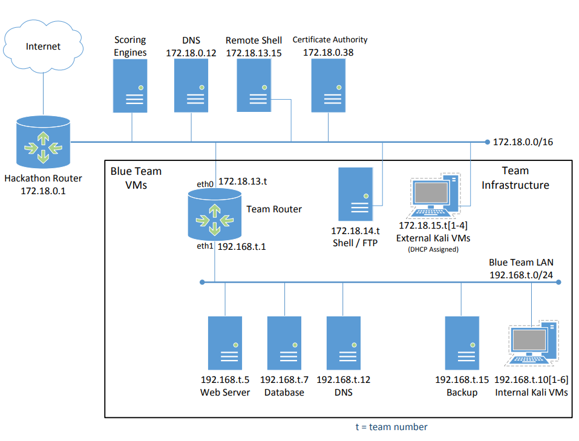

# Cybergames2024

## Scoring and Advancement 

- Teams may earn points by maintaining the integrity and uptime of their infrastructure services and by completing Capture-The-Flag challenges
- Teams must not interfere with scoring infrastructure
- Any action taken by a team or participant that disrupts scoring infrastructure or interferes with the functionality of the scoring engine or manual scoring checks are exclusively the responsibility of the teams
- Advancement to the NCAE National Invitational is granted by competition staff via invitation only. The team with the highest score is not guaranteed an invite. 
- Teams may increase their chances of securing an invite by:
    - Achieving high Infrastructure and CTF scores
    - Demonstrating exceptional teamwork and sportsmanship
    - Demonstrating exceptional growth and learning   

Point Values:
- Infrastructure: **10000 points**
- CTF: **2000 points**

## Topology 

The topology shown below is an example of a previous environment used in the NCAE Cyber Games. There are no assurances that future events will use this exact topology. On competition day, teams will gain access to an existing set of infrastructure systems that will be under attack by the NCAE Cyber Games red team. Blue teams are tasked with evicting the red team and securing their services against further attack while keeping the services active for the users (scoring criteria).

On competition day you will be assigned a team number **1-24**. The **t** in the diagram will be replaced by your team number. For example, Team15's router will be located at **192.168.15.1** internally and **172.18.13.15** externally.

## General Strategy 

1. Split into teams of two, combining upper and lower classmen 
2. Each pairing will cover a certain service
    1. FTP/Shell
    2. DNS
    3. Web Server
    4. Database
    5. Backup/Router
3. CTF is a break from services
    1. If your services are strong and all up, work on CTFs
    2. Don't spend more than 15min on a challenge 
    3. work as a team - we will have threads in Slack for each challenge so we can progress as a team

## Tips
1. create a backup sudo user 
2. check running processes for hints to malicious scripts 
    1. ps -ef 
3. Create scripts to hunt down certain processes
    1. ex: find the process that logs you out after a time period 
4. SSH for one user is highly recommended so you can copy and paste into the VM instead of having to manually type everything
5. Check the system users to remove any passwords they have to login or any shells they might have - they should have neither of these
6. What to do if you brick the machine - add into the guide 
https://blog.devgenius.io/knit-flask-nginx-reverse-proxy-5a7d65ccf912 